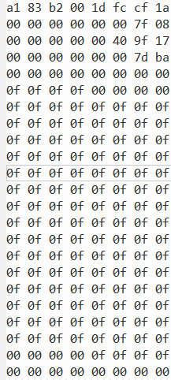

# 启动系统

```
tftpboot 0x90000000 d2000-devboard-dsk.dtb;tftpboot 0x90100000 uImage.gz;tftpboot 0x92100000 ramdiskfs.gz;bootm 0x90100000 0x92100000 0x90000000
```

```
tftpboot 0x90100000 uImage.gz;flashcp 0x10000000 0x90000000 0x10000;flashcp 0x10a10000 0x92100000 0x1400000;bootm 0x90100000 0x92100000 0x90000000
```

```
flashcp 0x10000000 0x90000000 0x10000;flashcp 0x10010000 0x90100000 0xa00000;flashcp 0x10a10000 0x92100000 0x1400000;bootm 0x90100000 0x92100000 0x90000000
```


# 查看磁盘UUID

命令

```
blkid
```

效果


# ramdiskfs.gz文件解压恢复

去掉头部分64字节

```
sudo dd if=ramdiskfs.gz of=ramdiskfs bs=64 skip=1
```

改名

```
mv ramdiskfs ramdiskfs.gz
```

解压为cpio格式

```
gunzip ramdiskfs.gz
```

建立文件夹并将cpio内解压

```
mkdir tmp;cd tmp
sudo cpio -idv < ../ramdiskfs
```

tmp文件夹就有文件系统内容，修改要修改得地方

恢复

```
find .|cpio -ov -H newc |gzip > ../ramdiskfs.img
```

回到上级目录

```
cd ..
```

将ramdiskfs.img更改为rootfs.cpio.gz，移动到文件系统目录下output/image目录下

```
mv ramdiskfs.img rootfs.cpio.gz
mv rootfs.tar.gz output/image
```

在文件系统目录下执行脚本

```
./mkramdisk.sh
```

在output/image目录下生成ramdisk.gz文件


# VC709测试NO.007

## SPI测试

### F3-cpu1

连接Xilinx的JTAG到F3

打开vivado软件，选择D:\document\feiq\V3.0\fpga\spi\f3_to_cpu1_2_pcie_4x_8g_spi\f1_to_cpu1_pcie_bd.runs\impl_1目录

选择bin文件和ltx文件烧录

等待烧录完成


拷贝测试文件到cpu1

添加权限

```
chmod +x spi_error_bit_rate_test
```

执行测试

```
./spi_error_bit_rate_test -D /dev/spidev1.0 -v -s 16000000
```

测试时间10分钟


### F3-cpu2

根据F3-cpu1基础上

拷贝测试文件到cpu2

添加权限

```
chmod +x spi_error_bit_rate_test
```

执行测试

```
./spi_error_bit_rate_test -D /dev/spidev1.0 -v -s 16000000
```

测试时间10分钟


### F1-cpu1

连接Xilinx的JTAG到F1

打开vivado软件，选择D:\document\feiq\V3.0\fpga\spi\f1_to_cpu1_pcie_4x_8g_spi\f1_to_cpu1_pcie_bd.runs\impl_1目录

选择bin文件和ltx文件烧录

等待烧录完成


拷贝测试文件到cpu1

添加权限

```
chmod +x spi_error_bit_rate_test
```

执行测试

```
./spi_error_bit_rate_test -D /dev/spidev1.0 -v -s 16000000
```

测试时间10分钟


### F2-cpu2

连接Xilinx的JTAG到F1

打开vivado软件，选择D:\document\feiq\V3.0\fpga\spi\f1_to_cpu1_pcie_4x_8g_spi\f1_to_cpu1_pcie_bd.runs\impl_1目录

选择bin文件和ltx文件烧录

等待烧录完成


拷贝测试文件到cpu1

添加权限

```
chmod +x spi_error_bit_rate_test
```

执行测试

```
./spi_error_bit_rate_test -D /dev/spidev1.0 -v -s 16000000
```

测试时间10分钟


## PCIE测试

### F1-cpu1

烧录FPGA程序bit文件

目录D:\document\feiq\V3.0\fpga\pcie\20.2\F1_2\xdma_intloop.runs\impl_1

重启cpu1

查看pcie接口情况

```
lspci -vv
```

拷贝测试程序文件

添加权限

```
chmod +x SSB_PRACH_test
```

执行测试

```
taskset -c 3 ./SSB_PRACH_test
```

查看测试记录

```
cat log
```


### F2-cpu2

测试异常，使用无中断的FPGA程序测试


测试结果


### F3-cpu1

异常


### F3-cpu2

烧录FPGA程序bit文件

目录D:\document\feiq\V3.0\fpga\pcie\20.2\F3_CPU2\xdma_intloop.runs\impl_1

重启cpu1

查看pcie接口情况

```
lspci -vv
```

拷贝测试程序文件

添加权限

```
chmod +x SSB_PRACH_test
```

执行测试

```
taskset -c 3 ./SSB_PRACH_test
```

查看测试记录

```
cat log
```


## 网口测试

修改网口ip

```
ifconfig eth0 192.168.1.20
```

检查网口是否Link

```
ethtool eth0
```

LINk状态为YES

ping主机

```
ping 192.168.1.28
```


测试两个CPU


## 通信UART测试

进行回环测试

查看/dev设备

```
ls /dev | grep ttyAMA0
```

ttyAMA0是通信串口，ttyAMA1是调试串口

启动配置microcom工具

```
microcom -t 5000 -s 115200 /dev/ttyAMA0
```

输入内容会有显示，等待5s之后就会自动退出


## GPIO测试

拷贝测试程序

目录D:\document\feiq\V3.0\测试用例\测试用例\GPIO

添加权限

```
chmod +x gpio.sh
```

查看gpio情况

```
cat /sys/kernel/debug/gpio
```


申请gpio

```
./gpio.sh 3
```


gpio置低电平

```
./gpio.sh 0
```


gpio置高电平

```
./gpio.sh 1
```


## 看门狗测试

改内核看门狗驱动

drivers/watchdog/gpio_wdt.c

修改第61行内容，将0修改为1

关闭喂狗信号

编译

```
./build kernel
```

进入uboot界面

```
tftpboot 0x90100000 uImage.gz;flashcp 0x10000000 0x90000000 0x10000;flashcp 0x10a10000 0x92100000 0x1400000;bootm 0x90100000 0x92100000 0x90000000
```

启动系统，过一会系统重启


## 问题

### NO.011

拔网线就重启，可能是这个是因为他们PHY的复位跟CPU复位连一块了


cpu2发cpu1时，发送内容每两次丢一次包

cpu1发cpu2收不到数据，这个是因为没有连接网线


cpu1-cpu2发送数据时，空数据正常，

发送一位数据正常，发送2位数据出现丢包，丢包50%

发送3位数据不仅丢包，之后的1位数据和空数据会出错


# VC709测试NO.004

## SPI测试

### F3-cpu1

连接Xilinx的JTAG到F3

打开vivado软件，选择D:\document\feiq\V3.0\fpga\spi\f3_to_cpu1_2_pcie_4x_8g_spi\f1_to_cpu1_pcie_bd.runs\impl_1目录

选择bin文件和ltx文件烧录

等待烧录完成


拷贝测试文件到cpu1

添加权限

```
chmod +x spi_error_bit_rate_test
```

执行测试

```
./spi_error_bit_rate_test -D /dev/spidev1.0 -v -s 16000000
```

测试时间10分钟


### F3-cpu2

根据F3-cpu1基础上

拷贝测试文件到cpu2

添加权限

```
chmod +x spi_error_bit_rate_test
```

执行测试

```
./spi_error_bit_rate_test -D /dev/spidev1.0 -v -s 16000000
```

测试时间10分钟


### F1-cpu1

连接Xilinx的JTAG到F1

打开vivado软件，选择D:\document\feiq\V3.0\fpga\spi\f1_to_cpu1_pcie_4x_8g_spi\f1_to_cpu1_pcie_bd.runs\impl_1目录

选择bin文件和ltx文件烧录

等待烧录完成


拷贝测试文件到cpu1

添加权限

```
chmod +x spi_error_bit_rate_test
```

执行测试

```
./spi_error_bit_rate_test -D /dev/spidev1.0 -v -s 16000000
```

测试时间10分钟


### F2-cpu2

连接Xilinx的JTAG到F1

打开vivado软件，选择D:\document\feiq\V3.0\fpga\spi\f1_to_cpu1_pcie_4x_8g_spi\f1_to_cpu1_pcie_bd.runs\impl_1目录

选择bin文件和ltx文件烧录

等待烧录完成


拷贝测试文件到cpu1

添加权限

```
chmod +x spi_error_bit_rate_test
```

执行测试

```
./spi_error_bit_rate_test -D /dev/spidev1.0 -v -s 16000000
```

测试时间10分钟


## PCIE测试

### F1-cpu1

烧录FPGA程序bit文件

目录D:\document\feiq\V3.0\fpga\pcie\20.2\F1_2\xdma_intloop.runs\impl_1

重启cpu1

查看pcie接口情况

```
lspci -vv
```

拷贝测试程序文件

添加权限

```
chmod +x SSB_PRACH_test
```

执行测试

```
taskset -c 3 ./SSB_PRACH_test
```

查看测试记录

```
cat log_ssb
```


### F2-cpu2

测试异常，cpu2无法识别xdma接口

无中断的FPGA程序测试仍然异常


### F3-cpu1

异常，无法识别到xdma接口

无中断的FPGA程序测试可以识别到xdma接口，但是无法获取信息


### F3-cpu2

烧录FPGA程序bit文件

目录D:\document\feiq\V3.0\fpga\pcie\20.2\F3_CPU2\xdma_intloop.runs\impl_1

重启cpu1

查看pcie接口情况

```
lspci -vv
```

拷贝测试程序文件

添加权限

```
chmod +x SSB_PRACH_test
```

执行测试

```
taskset -c 3 ./SSB_PRACH_test
```

查看测试记录

```
cat log_ssb
```


## 网口测试

修改网口ip

```
ifconfig eth0 192.168.1.20
```

检查网口是否Link

```
ethtool eth0
```

LINk状态为YES

ping主机

```
ping 192.168.1.28
```


测试两个CPU


## 通信UART测试

进行回环测试

查看/dev设备

```
ls /dev | grep ttyAMA0
```

ttyAMA0是通信串口，ttyAMA1是调试串口

启动配置microcom工具

```
microcom -t 5000 -s 115200 /dev/ttyAMA0
```

输入内容会有显示，等待5s之后就会自动退出


## GPIO测试

拷贝测试程序

目录D:\document\feiq\V3.0\测试用例\测试用例\GPIO

添加权限

```
chmod +x gpio.sh
```

查看gpio情况

```
cat /sys/kernel/debug/gpio
```


申请gpio

```
./gpio.sh 3
```


gpio置低电平

```
./gpio.sh 0
```


gpio置高电平

```
./gpio.sh 1
```


## 看门狗测试

改内核看门狗驱动

drivers/watchdog/gpio_wdt.c

修改第61行内容，将0修改为1

关闭喂狗信号

编译

```
./build kernel
```

进入uboot界面

```
tftpboot 0x90100000 uImage.gz;flashcp 0x10000000 0x90000000 0x10000;flashcp 0x10a10000 0x92100000 0x1400000;bootm 0x90100000 0x92100000 0x90000000
```

启动系统，过一会系统重启


# QSPI测试

修改内核配置

```
vim drivers/mtd/spi-nor/phytium-quadspi.c
```

频率=600M/分频


526行读分频为0x6即64分频，频率为9.375Mhz

593行写分频为0x3即8分频，频率为75MHz

642行擦除分频为默认值0x5即32分频，频率为18.75MHz

修改参数，减少分频数提高读写擦除速率


进入系统

```
xxd /dev/mtd3 | head -n 10
```

即可查看部分内容，mtd3为内核镜像文件uImage.gz文件，打开uImage.gz包查看前10行内容是否一致


### 内容修改

526行读分频为0x3即8分频，频率为75Mhz

593行写分频为0x3即8分频，频率为75MHz

642行擦除分频为默认值0x5即32分频，频率为18.75MHz

测试失败，读flash的时候出现错误，系统无法启动，使用uboot出现更换镜像启动系统

```
tftpboot 0x90100000 uImage.gz;flashcp 0x10000000 0x90000000 0x10000;flashcp 0x10a10000 0x92100000 0x1400000;bootm 0x90100000 0x92100000 0x90000000
```


526行读分频为0x4即16分频，频率为37.5Mhz

593行写分频为0x3即8分频，频率为75MHz

642行擦除分频为默认值0x5即32分频，频率为18.75MHz

测试失败，读flash的时候出现错误，系统无法启动，使用uboot出现更换镜像启动系统

```
tftpboot 0x90100000 uImage.gz;flashcp 0x10000000 0x90000000 0x10000;flashcp 0x10a10000 0x92100000 0x1400000;bootm 0x90100000 0x92100000 0x90000000
```


526行读分频为0x5即32分频，频率为18.75Mhz

593行写分频为0x3即8分频，频率为75MHz

642行擦除分频为默认值0x5即32分频，频率为18.75MHz

测试失败，读flash的时候出现错误，系统无法启动，使用uboot出现更换镜像启动系统

```
tftpboot 0x90100000 uImage.gz;flashcp 0x10000000 0x90000000 0x10000;flashcp 0x10a10000 0x92100000 0x1400000;bootm 0x90100000 0x92100000 0x90000000
```


### 更换boot

启动系统

擦除分区

```
flash_erase /dev/mtd0 0 0
flash_erase /dev/mtd1 0 0
```

写入

```
flashcp u-boot.bin /dev/mtd0
```

重启


```
tftpboot 0x90000000 fip-all.bin
flashe 0 0x0 0x400000
flashw 0 0x90000000 0x0 0x400000
```


```
md.b 0 0x30
```


### 修改ramdisk的挂载

将mtd5取消挂载，时钟为18.75MHz的qspi就能启动成功

这里忘记关掉看门狗了，所以启动之后会一直重启


### 修改内核配置

```
vim drivers/mtd/spi-nor/phytium-quadspi.c
```


修改值


554行添加内容

~~修改延时即在557行~~


更正

添加到括号之外，否则只有启动四线模式才能调用


### 速率测试

启动系统

测试环境

读时钟频率：75Mhz

写时钟频率：75Mhz

擦除时钟频率：18.75Mhz

指令

```
flash_speed -c 50 -d /dev/mtd3
```

结果


读速率：4500KB/s

写速率：1094KB/s

擦除速率：14000KB/s

但是不太稳定，可能需要降低速率

读时钟频率：32.5Mhz

写时钟频率：75Mhz

擦除时钟频率：18.75Mhz

指令

```
flash_speed -c 50 -d /dev/mtd3
```

结果


读速率：4500KB/s

写速率：1094KB/s

擦除速率：14000KB/s


# boot测试

读出系统的boot源代码

```
dd if=/dev/mtd0 of=/root/boot.bin
```


# 重启测试

测试reboot启动超过情况

更新了A3PE程序

- ###### 第1次

cpu1	reboot成功

cpu2	reboot成功

- ###### 第2次

cpu1	reboot成功

cpu2	reboot成功

- ###### 第3次


cpu1	reboot成功

cpu2	reboot成功

- ###### 第4次


cpu1	reboot成功

cpu2	reboot成功

- ###### 第5次


cpu1	reboot成功

cpu2	reboot成功

- ###### 第6次


cpu1	reboot成功

cpu2	reboot成功

- ###### 第7次


cpu1	reboot成功

cpu2	reboot成功

- ###### 第8次


cpu1	reboot成功

cpu2	reboot成功

- ###### 第9次


cpu1	reboot成功

cpu2	reboot成功

- ###### 第10次


cpu1	reboot成功

cpu2	reboot成功


# UPF驱动与帧交换联通

交换板的cpu端口号为0x33，需要添加

客户那边修改了交换板模式，现在变成了流模式，现在的程序无法进行完整测试，因为流模式屏蔽了中断，现有程序无法判断如何接收程序

客户现在要测试驱动是否能够进行通信，所以屏蔽掉接收程序，只运行发送程序

客户可以收到数据，但是数据的顺序需要改动


第二次测试发现奇怪现象，之前的程序无法使用，使用的是eth0网口，多次尝试无果，改换成lo程序

发送数据应该是小端数据，每16位从低位开始读，我们现在的程序是每8位从低位开始读，客户这边开始使用8位从低位开始读，帧交换和FPGA同时报错，猜测是FPGA端的问题

使用16位对其还是8位对其还未确定


# 帧交换测试

### 初始代码

调试帧交换代码，准保障确性

cpu1发cpu2不存在稳定性问题，不会卡死，但是会把ssh卡掉

速率上不去

修改352行的数据量

增加打印值查看帧交换模块发送和接受

接受410行

发送741行

分别看发送端，接收端和pcie速率，也有可能网口速率有关


帧交换启动时，客户端发送端速率，大概12MB/s


帧交换启动时，接收端接受速率，大概10MB/s


不开启帧交换，客户端发送速率587MB/s


可能是网口问题，百兆网口


增加延时5ms稳定

发送端


接收端


延时5us 相对稳定

发送端


接收端


稳定情况下

server端接收数据与transfer发送数据大小一致，应该没有问题

client发送数据与transfer接收的数据大小不同，排除了其他帧结构，数据量应该是一致的才对，但是验证结构数据没有问题，初步判断只是检测有效数据大小不对


### 测试虚拟网口

测试服务端未接收到数据

添加了禁止9000端口号的指令

修改udp_pack.c第161行端口号，接收完成


CPU1客户端发送包大小1024，速率124MB/s


CPU1帧交换接收速率12MB/s


通过底层传输之后，CPU2帧交换发送速率4MB/s，误码率特别高


速率问题很有可能时CPU负载太高了，分配给多个核处理


### 关闭PCIE

将宏定义中PCIE_WR注释掉


### 测试误码率

测试误码率特别高的原因，看看什么部分开始误码

对每个部分进行检测

帧交换接收数据校验


通过底层接口到帧交换发送


误码出现，很大可能是在F3或者交换板出现丢包和误码


将误码情况打印出来


发现，很多时候帧长不一致，偶尔会出现接收到数据包含帧头的情况，猜测是FPGA接收时丢包，截取帧时将下一帧内容截取过来了


找FPGA侧和交换侧抓一下包看看情况

交换抓包接收帧与发送帧相同


### 测试PCIE误码情况

修改代码，直接对PCIE进行读写查看误码情况

发送速率34MB/s


接收速率4MB/s，丢包是代码bug，可忽略


发现仍然有相同情况，基本可以断定就是底层传输出现问题，导致丢包


# 流模式

### 测试

流模式，关闭by_pass，和与之相关的ptr指针

注释掉fpga_init函数

让CPU一直处于接收状态

运行帧交换，出现错误


PCIE接口信号，指示准备接受或者发送，现在卡住了，XDMA繁忙，无法接受FPGA发送的数据，xdma读的过程无法写，使用FPGA直接发送没有接受过程，可以直接发送

FPGA的XDMA IP核配置


打印两个帧的数据，看看不同之处

官方的流模式验证方法也不适用，是否是FPGA端的问题，错误可能和last信号有关


IP设置为Stream模式，默认Linux上有循环Buffer来处理接收的数据。如果Stream接收的速率太高，超过驱动和应用能处理的范围，就会出现溢出的问题。出现溢出后，驱动里做了错误恢复，一段数据就丢掉了-----现在的问题是没有接收


FPGA修改程序，接收完毕直接发送，不做任何处理

此时xilinx官方的案例可以正常使用


xdma中断确实有中断

read的buff修改32，有效，确实接收到了值

修改buffer的位宽，修改一次读的量

使用最新的帧交换程序进行测试，看看收发是否正常


现在流模式测试最大速率发送为20MB/s，接收为20MB/s，是否需要修改PCIE速率配置

加125us延时速率5MB/s


FPGA程序需要等待XDMA的IP核拉高一个信号才会进行发送数据，否则就一直堆积数据，堆积满之后会将之后的数据丢弃掉


FPGA处理帧最大1600字节，超过就会丢弃掉


使用回环测试FPGA程序，每帧32k数据，不加125us延时，最大速率250MB/s


增加125us延时，最大速率100MB/s


使用2K数据收发，不加延时，最大速率58MB/s，


### 问题

#### 问题一

每次对PCIE写大于2k的数据就会报错，并且会导致FPGA端寄存器异常，之后改用小于2K的数据也无法正常写入


### 帧交换

#### 4K

完整的帧交换流程，数据量4k，速率17MB/s


如果是裸写PCIE，最大速率60MB/s


#### 32k整包

帧交换流程，数据量32k，延时125us，只接受不处理，不经过PCIE

client --> 帧交换接收，速率143MB/s


帧交换流程，数据量32k，延时125us，接收并且处理数据，但是不写入PCIE

client --> 帧交换接收 --> 处理，速率48MB/s


帧交换流程，数据量32k，延时125us，接收但是不做转换，写入PCIE

client --> 帧交换接收 --> 写PCIE，速率98MB/s


完整的帧交换流程，数据量32k，延时125us，接收并且做转换，写入PCIE

client --> 帧交换接收 --> 处理 --> 写PCIE，速率36MB/s


#### 32k组包

完整测试写流程，client无延时发送1k数据，帧交换接收到32K数据，不写PCIE

速率为26MB/s


取消大小端处理

速率为50MB/s


取消大小端并且读写PCIE

速率为45MB/s


打开大小端并且读写PCIE

速率25MB/s


速率影响情况分析：可能是每次接收间隔太长了，导致接收数据量减少，达成32k内容的速度变慢


更换最新的优化代码，client发送1600字节

不大小端转换，不写


添加读写

速率160MB/s


## 第二版

测试读写速率


需修复的问题

接收到的数据量与写进去的数据量


# 大小端问题


# 计时问题

计时单位必须大于100us计时才会精准


# 启动计时

启动boot花费36s

拷贝启动系统需要得文件花费34s


往3个flash写3个系统所需文件花费时间175s，平均写一个58s，接近一分钟，25MB数据

速率0.43MB/s


### 双d2000

启动boot花费30ss

拷贝启动系统需要文件花费34s

启动系统5ss


# 问题

- 帧交换IP地址，实际上不需要
- 帧顺序问题，读先后顺序问题，高位读还是低位读
- 流模式问题，FPGA如何给我信号通知CPU读取内容

先发送在打开帧交换

- QSPI速率只能编辑挡位，不能细化，延时问题可以直接读寄存器，询问这个延时有啥作用提高QSPI速率，需要根据信号通过A3PE和Flash的时间进行配置延时
- 流模式，关闭by_pass，和与之相关的ptr指针，


- 虚拟网口lo会发送两次，这个问题得解决一下


换一个虚拟网口，不使用回环，问题解决


- FPGA接收帧会丢失最后几个帧，变为0
- 所有代码中出现的问题，发送帧长少了4字节，create_sdl函数

- 0x33端口问题

  

修改了代码帧标签处理部分的一个bug，解决

- 错误


交换数据环回

查看PCIE线上信号

xdma timeout配置 

实现确保有数据输入，再去看帧处理


修改XDMA的timeout配置

```
insmod xdma.ko c2h_timeout=0 h2c_timeout=0
```

修改之后发送警告


修改之后接收警告


修改启动文件，将inmod初始化添加参数

~~配置编译环境~~

ramdiskfs.gz文件解压恢复

还是失败


定时还是读时间的问题

读时间可能会发生有循环延时没读到指定的时间问题，还是得定时读取


非常奇怪的现象

读写PCIE时必须先写9次才能开始读


解决方法：tlast信号问题


最新代码段错误原因：线程超过4个


FPGA对大包解包有问题


未大小端数据




# 任务

- ~~联系一下健哥流模式的读写情况~~
- ~~只调用PCIE读写查看PCIE链路误码情况~~
- 大小端转换丢失问题（待验证）
- 正常链路查看PCIE读写出数据内容
- ~~CPU核的速率问题~~
- ~~xdma timeout配置~~
- 查看PCIE链路是否收到FPGA发出的信号


- ~~测试最大接收BUFF长度告诉明昊~~
- ~~测试QSPI速率~~
- ~~测试新的D2000板卡~~
- ~~修改系统名称，添加+~~
- ~~测试FPGA不做如何处理直接收发的速率~~


- ~~流模式FPGA侧问题~~
- ~~回环测试代码~~
- ~~读出boot源代码对比~~

- ~~最新程序环回测试~~
- 查看CPU占用率


- 使用dma不用去读写PCIE，直接读取内存
- 多核处理

- 修改测试代码，测试发送端1024，帧交换组帧发送

- 是否需要使用多线程来接收client的信号


- 查表耗费太多时间，那么就不查表如何，改变整体结构


- ~~解决125us问题~~
- ~~了解最新方案~~
- ~~每帧1600~~


- 更换系统
- 测试flash


- ~~UCF~~
- 政审表
- ~~修改最新代码bug（crc和帧头校验，大小端）~~
- ~~测试新一版代码~~
- spi回环（接引脚）
- 看门狗
- 串口
- GPIO
- 反压信号，没准备好接收交换收来的数据


- poll轮询


- 双D2000PCIE测试，直接CPU发FPGA接收回环到CPU

- boot文件修改读频率


# 同步信息

- sdl帧帧长部分要加帧头
- crc校验问题
- 帧结构变化


