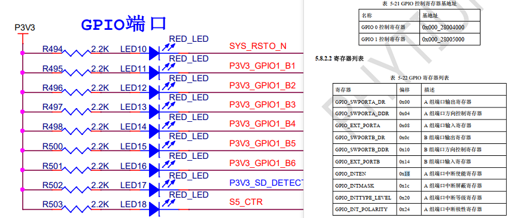

# python

## re.findall正则表达式

导入re库：import re

```
out = refindall(r'\d{3}:\d{1}', x) 
```

将x中xxx:x的格式的字符提取出到数组out中；

```
out = re.findall(r':(\d{2})', x)
```

将x中的:xx部分的xx提取出到数组out中；


## 识别数组个数

```
out = len(name)
```

name是数组名，out是输出结果；


## 命令输出shell

- #### 导入os库：import os

```
os.system(cmd)
```

cmd是linux系统的指令，表示执行cmd命令；

```
out = os.popen(cmd)
output = out.read()
```

cmd是输入指令，out是返回文件指针，output是读取的内容；

```
os.path.exists(dir)
```

dir是文件名，检查当前目录是否存在dir文件；

```
os.path.isdir(dir)
```

dir是否为目录；

```
os.getcwd()
```

返回当前目录地址；

```
os.char(dir)
```

dir是文件绝对地址，表示切换到dir目录;


- #### 导入commands库：import comands

```
output = commands.getstatusoptput('ls -l')
```

返回ls -l指令的打印内容给output;


## 调用函数

- #### 不在类中：


直接调用函数名，例如out = test();

- #### 在类中：


需要在函数名前加self.xxx，例如self.test()，并且定义函数需要加入参数self，例如test(self, xxx)；


# 格式化盘

/dev/xxx为盘符地址，mkfs.xxx为需要格式的内容

```
mkfs.ext3 /dev/xxx
```

格式化xxx为ext3文件系统；

```
mkfs2fs -j /dev/xxx
```

格式化xxx为ext3文件系统；

```
mkfs.vfat /dev/xxx
```

格式化xxx为fat32文件系统；

```
mkfs.msdos /dev/xxx
```

格式化为fat16文件系统；


# 解压缩

- #### 压缩：


```
tar -zcvf tarname.tar.gz filename
```

将filename压缩，压缩包名为tarname.tar.gz

- #### 解压


```
tar -zxvf tarname.tar.gz -C filename
```

将tarname.tar.gz解压，解压出来的文件名为filename


# 容器转镜像

- #### 本地提交容器为镜像：


```
docker  commit  -a  "作者"  -m  "备注"  容器ID 上传名:标签
```

- #### 镜像：


```
docker save -o name.tar 镜像名:标签
```

将镜像打包，包名为name.tar

```
docker load -i  name.tar
```

载入镜像包

```
docker ps -a
```

查看容器

```
docker images
```

查看镜像

```
docker rm ID
```

删除容器

```
docker rmi ID
```

删除镜像

- #### Dockerfile文件：


FROM参数：设置源镜像

ENTERYPOINT参数：设置启动文件脚本


# 30服务器

外网连接

```
scp -P 9991 rootfs.tar.gz xxx@jrlc.link:/home/xxx/rootfs.tar.gz
```


# boot指令

### sf指令

使用sf read和sf write前，一定要调用sf probe

```
sf probe [[bus:]cs] [hz] [mode]
```

读取flash数据到内存

```
sf read 内存地址 flash地址 数据长度
```

从内存写数据到flash

```
sf write 内存地址 flash地址 数据长度
```

擦除flash数据内容

```
sf erase flash地址 数据长度
```


### md指令

```
md 0x1c000000 0x100
```

查看0x1c000000开始，长度256字节内存数据，可以验证sf的读写效果


# devmem工具

devmem查看寄存器的值

控制LED11亮灭



LED11属于GPIO1，所以基准地址为0x28005000

0x10寄存器控制B组端口方向模式，00000000分别对应B0-B7，此时所有B口都为输入状态

0x0c寄存器控制B组端口输出状态，00000000分别对应B0-B7，此时所有B口都为低电平

如上图，LED默认拉高，所以高电平LED灭，低电平LED亮

所以此时需要设置

0x10为00000010（0x02），加上基准地址，设置0x28005010寄存器为0x02

0x0c为00000010（0x02），加上机制地址，设置0x2800500c寄存器为0x02

设置GPIO1_B1为输出

```
devmem 0x28005010 w 0x02
```

设置GPIO1_B1为低电平，LED11亮

```
devmem 0x2800500c w 0x00
```

设置GPIO1_B1为高电平，LED11灭

```
devmem 0x2800500c w 0x02
```

因为没有设置其他口为输出模型，所以即使为低电平，也未生效


# git使用

git包含3个部分

- 工作目录
- 缓存区
- HEAD

工作目录就是使用的目录，缓存区是使用git add命令之后将文件添加到缓存区，HEAD是git commit之后提交的结果

还有一个部分远端仓库

- remote

将目录内容保存到远程仓库里，方便保存和使用


初始化目录

```
git init
```

将目录所有文件添加到缓存区

```
git add . -A
```

将缓存区所有文件添加到HEAD

```
git commit -m "描述"
```


# grep指令

```
grep [-acinv] [--color=auto] '查找内容' filename

-c :计算找到查找内容的次数
-i :忽略大小写
-n :输出行号
-v ：反向选择，输出无查找内容的部分
--color=auto :将关键字部分加上颜色
```


