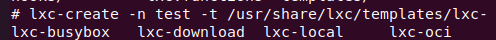
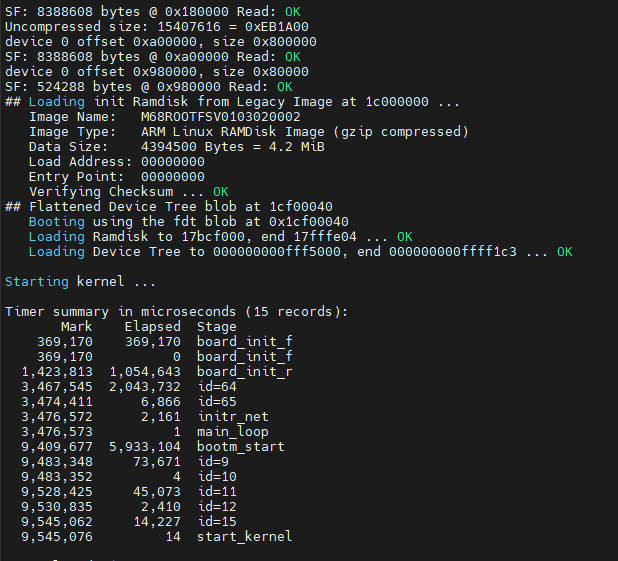

# 3883

## sparc协议

#### cmake交叉编译

ARCH=sparc  CC=parc-gaisler-linux4.9-gcc CXX=parc-gaisler-linux4.9-g++  cmake .. -DCMAKE_C_COMPILER=sparc-gaisler-linux4.9-gcc -DCMAKE_CXX_COMPILER=sparc-gaisler-linux4.9-g++

ARCH=sparc CC=sparc-gaisler-linux4.9-gcc CXX=sparc-gaisler-linux4.9-g++  cmake .. -DCMAKE_C_COMPILER=sparc-gaisler-linux4.9-gcc -DCMAKE_CXX_COMPILER=sparc-gaisler-linux4.9-g++ -DCMAKE_CXX_FLAGS=-latomic -DCMAKE_C_FLAGS=-latomic


## 启动虚拟sparc系统

qemu-system-sparc -M leon3_generic  -kernel image.ram  -nographic   -m 512


## 压缩rootfs.cpio

rootfs.cpio大小53M，需要压缩，可以选择直接使用tar指令，也可以在buildroot配置压缩

```shell
# make menuconfig
```

进入配置界面，输入"/"，开始搜索，输入cpio，找到BR2_TARGET_ROOTFS_CPIO

进入compression method，选择gzip

保存，退出，开始编译

```shell
# make -j4
```

进入输入目录

```shell
# cd output/images
```

查看文件rootfs.cpio.gz大小，17M

完成！


## LXC

linux容器（linux containers）：一种操作系统层虚拟化技术，为linux内核容器功能的一个用户空间接口；


LXC关键技术点：

- chroot，根切换，从容器角度来看，仿佛真的有自己的根树；
- namespaces：名称空间，负责将资源隔离，比如pid，网络，mnt，user，uts等；
- CGroups：控制组，负责控制资源的分配；


常用命令：

```shell
# lxc-checkconfig
```

检查系统环境是否满足容器需求；

```shell
# lxc-create -n name -t template_name [-- template-options]
```

创建lxc容器

```shell
# lxc-start -n name -d
```

启动容器

```shell
# lxc-info -n name
```

查看容器相关信息

```shell
# lxc-stop
```

停止容器

```shell
# lxc-destory
```

删除停止状态的容器

```shell
# lxc-snapshot
```

创建和恢复快照

```shell
<Ctrl+a q>
```

退出容器


### 记录：

在buildroot里配置，make menuconfig，按"/"搜索lxc，选中BR2_PACKAGE_LXC，选中lxc，保存退出，开始编译

编译完成进入虚拟sparc，使用指令

```shell
# lxc-checkconfig
```

报错


这里判断是没有libvirt，查找libvirt需求


查找BR2_PACKAGE_LIBVIRT

BR2_PACKAGE_LIBVIRT_ARCH_SUPPORTS未支持sparc，修改package/libvirt/Config.in文件，添加sparc支持


BR2_PACKAGE_HAS_UDEV为no
！！！

询问发现，不需要libvirt，选上内核包会很大！


选中上图内容即可

查找，无以上内容

使用make linux-menuconfig而不是make menuconfig

"/"搜索NAMESPACE，选中Namespaces support，回车进入


全部勾选，保存退出，重新编译

再次执行命令检查

```shell
# lxc-checkconfig
```

结果：


namespace完成

开始解决control group问题

参考https://blog.csdn.net/hylaking/article/details/90604020

结果：


CGROUP_PERF


func tracer ？？？

算了先不管


主要问题CGROUP_PERL


找了半天没有找到问题，最后


偶然发现perf_events需要sparc64，默认是sparc所以无法选中，选中之后去查看perf_events


depends on变成y了，输入1进去选中


现在去看看CGROUP_PERF


depends on变成y了，输入1进去选中


出现选项了，选中，保存退出，开始编译

出错了


编译错误，这要如何解决？？？

需要32bit系统，所有不能选中perf


跳过lxc-checkconfig报错直接创建




```shell
# lxc-create -n test -t /usr/share/lxc/templates/lxc-xxx
```

- 第一个lxc-busybox


失败

- 第二个lxc-download


没有网络配置，失败，配上网络应该可行

打开网址看看


- 第三个lxc-local


失败，找到rootfs


只有一个README文件？？？

打开看看


翻译：他的目录必须存在，即使它可能是空的。它用于将lxc的rootfs临时挂载到私有挂载命名空间中，该命名空间仅由容器中运行的进程可见。

- 第四个lxc-oci


失败


接下来目标，先不管文件大小，下载一个模板试试看是否能行

未找到下载文件

尝试直接ubuntu虚拟机上安装一个lxc，构建一个template，拷贝到sparc里


失败，但是原因有所变化，可能原因


编译的时候就报错，这里出了错


git下来一个lxc-templates，将编译的模板拷贝到sparc


和前面模板一样的问题


# 10所共性adrv9009

资料从百度云下载，下载了整整一晚上。。。

打开之后查看，发现，看不懂。。。

算了，还是中秋节过了去问一下吧，不管了。


### 编译

需求先理解一下，把内核代码先编译一下

30服务器上编译

将10s的z7的JARI系统内核编译出来，编译需要用到交叉编译

需要先安装mkimage

```
sudo apt-get install u-boot-tools -y
```

配置内核

```
make ARCH=arm CROSS_COMPILE=/home/yuanjilin/tools/compile_z7/bin/arm-linux-gnueabihf- menuconfig
```

编译

```
make ARCH=arm CROSS_COMPILE=/home/yuanjilin/tools/compile_z7/bin/arm-linux-gnueabihf- uImage LOADADDR=0x2380000 -j32
```

编译完成之后，内核文件在arch/arm/boot目录


编译文件系统

配置

```
make ARCH=arm CROSS_COMPILE=/home/yuanjilin/tools/gcc-linaro-7.4.1-2019.02-x86_64_arm-linux-gnueabihf/bin/arm-linux-gnueabihf- menuconfig
```

编译

```
make ARCH=arm CROSS_COMPILE=/home/yuanjilin/tools/gcc-linaro-7.4.1-2019.02-x86_64_arm-linux-gnueabihf/bin/arm-linux-gnueabihf- -j32
```

编译完成之后，文件系统在output/images目录


验证驱动需求，包括emmc、网口驱动、总线协议（spi、axi）、hp

之后适配射频驱动


### 下载

拿到板子了，连接电源和串口线进行测试

发现没有com端口

需要FT2232HL驱动，驱动文件在我电脑D:\驱动\CDM-v2.12.36.4.U-WHQL-Certified目录

完成，com口出现，有两个端口，com3和com4，测试com4可用

进入系统

账户：root

密码：无

插入TF卡，准备挂载下载系统包

TF卡出错，更换tf卡还是出错，与客户交流，客户也没使用过TF卡，应该是板子的问题


客户提供信息

**源程序boot似乎是在flash中，linux镜像在emmc中**


需要使用uboot联网验证测试，是否满足删除原本系统安装JARI系统条件

启动板卡，进入账户，输入reboot重启，根据提示进入uboot

使用网线连接板子和电脑

查看电脑与板子连接的网络，设置ip地址


设置板子ip，同网段，但是不能一样

```
setenv ipaddr 192.168.1.9
```


ping电脑ip，验证

```
ping 192.168.1.10
```


显示host is alive就表示配置完成

现在使用tftp传文件系统

板子上设置主机ip

```
setenv serverip 192.168.1.10
```

主机打开tftp软件，并且将要传输的文件放在该目录下


打开软件


板子输入指令

查看系统启动项

```
printenv
```


查找kernel_addr地址


查找文件系统地址

传输内核

```
tftpboot 1D000000 uImage
```

将文件uImage传输到地址0x1D000000

传输文件系统

```
tftpboot 02100000 rootfs.cpio.uboot
```

将rootfs.cpio.uboot传输到0x02100000

整合一下

```
setenv ipaddr 192.168.1.9 && setenv serverip 192.168.1.10
```

```
tftpboot 1D000000 uImage && tftpboot 02100000 JARI-Z7-ramdisk && tftpboot 1cf00040 JARI-Z7-dtb
```

~~增加启动参数~~

~~setenv bootargs "clk_ignore_unused cpuidle.off=1 earlycon=cdns,mmio,0xFF000000,115200n8 console=ttyPS0,115200 uio_pdrv_genirq.of_id=generic-uio loglevel=8 initcall_debug=1"~~

启动

```
bootm 1d000000 2100000 1cf00040
```

失败

对比一下，客户系统启动



自己的系统


### 验证

查看启动流程

从bootcmd开始追查流程


启动指令

```
run xilinxcmd && sf probe 0 0 0 && sf read $kernel_zip_addr $kernel_qspi_offset $kernel_size && unzip $kernel_unzip_addr $kernel_addr && sf read $initrd_addr $initrd_qspi_offset $initrd_size && sf read $dts_addr $dts_qspi_offset $dts_size && booti $kernel_addr $initrd_addr $dts_load_addr
```

内存里没有内核数据和文件系统数据，需要从flash里进行拉取，使用sf


使用客户内核，我们的文件系统，客户的设备树进行调试

解压客户内核

```
sf probe 0 0 0 && sf read $kernel_zip_addr $kernel_qspi_offset $kernel_size && unzip $kernel_unzip_addr $kernel_addr
```


读客户设备树

```
sf read $dts_addr $dts_qspi_offset $dts_size
```


拷贝我们自己的文件系统

```
tftpboot 02100000 JARI-Z7-ramdisk
```


~~读（错误原因）~~

~~sf read 2100000 $initrd_qspi_offset 98b2ee~~

启动

```
booti $kernel_addr 2100000 $dts_load_addr
```


完成

应该是我们的内核配置问题

查看文件系统配置文件

```
zcat  /proc/config.gz
```

使用该配置文件进行编译内核

自动配置网络

```
udhcpc -i eth0
```


使用ssh传输配置文件到30


### 测试

将客户提供的内核和设备树编译，内核配置文件替换为我们自己的配置文件

根据上述下载步骤重新下载编译

配置tftp

```
setenv ipaddr 192.168.1.9 && setenv serverip 192.168.1.10
```

下载内核

```
tftpboot 1d000000 Image
```

下载文件系统

```
tftpboot 2100000 JARI-Z7-ramdisk
```

下载设备树

```
tftpboot 1cf00040 mpsoc.dtb
```

整合

```
tftpboot 1d000000 Image && tftpboot 2100000 JARI-Z7-ramdisk && tftpboot 1cf00040 mpsoc.dtb
```

启动

```
booti 1d000000 2100000 1cf00040
```

启动完成


### 启动

直接使用该配置编译JARI内核

```
make ARCH=arm64 CROSS_COMPILE=aarch64-linux-gnu-   menuconfig
```

```
make ARCH=arm64 CROSS_COMPILE=aarch64-linux-gnu- -j64
```

配置tftp

```
setenv ipaddr 192.168.1.9 && setenv serverip 192.168.1.10
```

下载内容

```
tftpboot 1d000000 Image && tftpboot 2100000 JARI-Z7-ramdisk && tftpboot 1cf00040 mpsoc.dtb
```

启动

```
booti 1d000000 2100000 1cf00040
```

启动失败，卡死

内核有问题


### 编译内核

现在有

JARI 4.19.90（我们自己的）

SDK 4.19.0（客户提供）

Linux 4.19.0（官方标准文件https://mirrors.edge.kernel.org/pub/linux/kernel/v4.x/）

Linux 4.19.90（官方标准文件）

需要将客户对于标准linux对应版本的修改应用到我们自己的JARI系统上

#### 思路1

将SDK 4.19.0和Linux 4.19.0进行对比，生成patch，然后对JARI 4.19.90打入补丁，会有冲突文件XXX.rej，这时候需要手动查看xxx.rej文件进行修改

##### 操作

将SDK 4.19.0源文件清理一下

```
make distclean
```

复制SDK 4.19.0源码到Linux 4.19.0文件

```
cp /home/yuanjilin/10S-Z7/adrv9026_kernel/Source/linux-xlnx-xlnx_rebase_v4.19_2019.2/* . -rfpd
```

添加到缓存区

```
git add . -A
```

查看

```
git status .
```

添加到仓库并且命名

```
git commit -m "merge xilinx code"
```

制作补丁

```
git format-patch  -1
```


#### 思路2

将Linux 4.19.0与Linux 4.19.90对比，生成patch，对SDK 4.19.0打入补丁进行升级，成为JARI 4.19.90，会有冲突文件XXX.rej，这时候需要手动查看xxx.rej文件进行修改

##### 操作

复制Linux 4.19.90源码到Linux 4.19.0文件

```
cp ../linux-4.19.90/* . -rfpd
```

添加到缓存区

```
git add . -A
```

查看

```
git status .
```

添加到仓库并且命名

```
git commit -m "linux 4.19.0 to 4.19.90"
```

制作补丁

```
git format-patch  -1
```


```
git commit -m "init repo as linux 4.19.90 main stream"
```


# 飞腾测试

### 测试硬盘速率

dd指令测试写速度

```
dd if=/dev/zero of=test bs=4M count=100
```


 dd指令测试读速度

```
dd if=test of=/dev/null
```


### 网速测试

iperf是client向server段发送数据

client显示发送速率，server显示接收速率

配置板子网络

```
ifconfig eth0 up
udhcpc -i eth0
```

##### 测试发送速率

板子作为client

```
iperf -c 192.168.1.85 -P 6 -t 60
```

50作为server

```
iperf -s
```

##### 测试接收速率

板子作为server

```
iperf -s
```

50作为client

```
iperf -c 192.168.4.160 -P 6 -t 60
```

##### 结果

网口eth0  网口有问题 

 网口eth1  发送速率94.2Mbits/s


接收速率94.2Mbits/s


网口enp2s0f0  网口有问题 

网口enp2s0f1  发送速率94.3Mbits/s 


接收速率94.2Mbits/s


  

### 测试串口

使用串口调试工具

板子命令行控制串口输出，调试工具查看

```
echo 123456 > /dev/ttyAMA3
```


### 测试can

配置板卡can0波特率为1Mcd /bo		

```
ifconfig can0 down;ip link set can0 type can bitrate 1000000;ip link set can0 up
```

连接can分析仪和软件

板卡发送数据

```
cansend can0 123#DEADBEEF
```

板卡接收数据

```
candump can0
```


### 测试GPIO

#### devmem工具

devmem查看寄存器的值

控制LED11亮灭


LED11属于GPIO1，所以基准地址为0x28005000

0x10寄存器控制B组端口方向模式，00000000分别对应B0-B7，此时所有B口都为输入状态

0x0c寄存器控制B组端口输出状态，00000000分别对应B0-B7，此时所有B口都为低电平

如上图，LED默认拉高，所以高电平LED灭，低电平LED亮

所以此时需要设置

0x10为00000010（0x02），加上基准地址，设置0x28005010寄存器为0x02

0x0c为00000010（0x02），加上机制地址，设置0x2800500c寄存器为0x02

设置GPIO1_B1为输出

```
devmem 0x28005010 w 0x02
```

设置GPIO1_B1为低电平，LED11亮

```
devmem 0x2800500c w 0x00
```

设置GPIO1_B1为高电平，LED11灭

```
devmem 0x2800500c w 0x02
```

因为没有设置其他口为输出模型，所以即使为低电平，也未生效


#### 使用GPIO位号配置

进入/sys/class/gpio目录可以看到


飞腾设定2个GPIO口，分别是gpio0和gpio1

每组gpio口包含16个GPIO，分别对应A0-7，B0-7

使用480和496就是这两个gpio的起始位号

这里查找的是LED11，就是GPIO1_B1

##### 验证

假定496为gpio1的起始位号，GPIO1_B1位号为496+8+2=506

```
echo 506 > /sys/class/gpio/exprt
```

查看目录


进入GPIO506目录，查看direction状态

```
cat direction
```


in表示输入状态，修改为输出状态

```
echo out > direction
```

查看direction状态


现在查看value的值


此时LED11灯应该亮起，但是板子上灯是熄灭状态


##### 结论

所以gpio1的起始位号是480，GPIO1_B1位号为480+8+2=490

```
echo 490 > /sys/class/gpio/exprt
```


进入GPIO506目录，查看direction状态

```
cat direction
```


in表示输入状态，修改为输出状态

```
echo out > direction
```

查看direction状态


现在查看value的值


此时LED11灯应该亮起，板子上灯是也是亮起状态，应该是将direction设置为out之后就亮起了

现在改变value值

```
echo 1 > value
```

现在板子上LED11熄灭

完成


### memtester内存压力测试

下载安装包https://pyropus.ca./software/memtester/

解压

```
tar xf memtester-4.5.1.tar.gz
```

进入文件，准备交叉编译

修改文件conf-cc和conf-ld

将cc修改为交叉编译工具链

修改Makefile安装路径，方便打包

将20行INSTALLPATH修改为用户路径

编译安装

```
make && make install
```

将安装目录打包发送到板子上

测试

```
./memtester 256 1 
```

测试256MB内存，测试1次


完成！


### ltp系统压力测试

git下载ltp源码

```
git clone https://gitlab.jrlc.link:442/jrlcgroup/testcases/ltp.git
```

进入ltp文件

```
make autotools
```

配置安装目录和交叉编译工具链

```
./configure --prefix=/home/jrlc/install CC=/home/jrlc/toolchain/gcc-linaro-7.5.0-2019.12-x86_64_aarch64-linux-gnu/bin/aarch64-linux-gnu-gcc --host=aarch64-linux
```

编译安装

```
make && make install
```


ltp测试不跑失败测试，只跑通过测试

崩溃


使用最小测试集


### rtc验证

根据客户需求，添加rtc-i2c驱动，ds1307驱动，将客户代码与/home/yuanjilin/JARL/linux-kprl/drivers/rtc目录的rtc-ds1307.c文件替换

配置内核

```
make ARCH=arm64 CROSS_COMPILE=aarch64-linux-gnu- -j64 menuconfig
```

搜索ds1307

选中RTC_DRV_DS1307

保存退出，开始编译

报错


```
grep -inr rtc_add_group drivers/
```


将rtc-core.h头文件包含到rtc-ds1307.c中，重新编译

编译完成！


rtc时间设置

先设置系统时间

```
date 092910002022.00
```

设置时间，月/日/时/分/年.秒

或者

```
date 202009291000.0
```

年/月/日/时/分.秒

同步系统时间到硬件

```
hwclock -w
```

查看硬件时间

```
hwclock -r
```

硬件时间就变成2022.09.29 10:10:00


rtc-i2c系统掉电之后时间复位


### 开机默认打开网口

修改目录/etc/init.d下的文件S50telnet文件，添加命令

```
ifconfig eth0 up
ifconfig eth1 up
ifconfig enp2s0f1 up
ifconfig enp2s0f0 up
```


### 看门狗配置

目录

```
/home/yuanjilin/JARL/linux-kprl
```

配置

```
make ARCH=arm64 CROSS_COMPILE=aarch64-linux-gnu- -j64 menuconfig
```

搜索

CONFIG_ARM_SBSA_WATCHDOG

CONFIG_ACPI_GTDT

确保全部选中，编译即可

```
make ARCH=arm64 CROSS_COMPILE=aarch64-linux-gnu- -j64
```

启动系统

```
echo 1 > /dev/watchdog
```

过一会系统重启，看门狗驱动完成


### ADC驱动

目录

```
/home/yuanjilin/JARI/linux-kprl
```

配置

```
make ARCH=arm64 CROSS_COMPILE=aarch64-linux-gnu- -j64 menuconfig
```

搜索

GENERIC_ADC_THERMAL

选中状态

编译

```
make ARCH=arm64 CROSS_COMPILE=aarch64-linux-gnu- -j64
```

启动系统，查看

```
ls /sys/class/thermal/
```

无内容，待完善


### minicom

修改文件

```
/home/wangx/kw/kprl/output/ZX/T3/CQA3T_BV3_DK/build/minicom-19ab49422f3431102c31fea01549121385113f80/src/minicom.c
```

第1019行函数修改

直接再函数调用时return，不执行任何操作，测试函数，不会影响程序运行


### LTP

将ltp-testsuite.tar发送到板子

解压

```
tar xf ltp-testsuite.tar
```

进入ltp-testsuite

```
cd ltp-testsuite-install
```

运行

```
./runltp -p -f test -l ltp_kernel.log -o ltp.output
```

测试结果再results目录下的ltp_kernel.log文件


### memtester

将memtester-testcase.tar发送到板子

解压

```
tar xf memtester-testcase.tar
```

进入ltp-testsuite

```
cd memtester-testsuite-install/bin
```

运行

```
./memtester 256 1
```

测试256MB，测试一次


### 内核编译环境

内核目录删除除了scripts之外所有的.c文件

```
mv scripts ../
rm `find -name "*.c"`
mv ../scripts .
```


### 网口问题

问题描述：将网口down之后再up，网口link不上


将yt8521驱动添加

源码地址30服务器

```
/home/yuanjilin/JARI/buildmod/yt-phy-driver/linux
```

将drivers和include文件拷贝到内核源码

修改配置

```
vim /home/yuanjilin/JARI/linux-kprl/drivers/net/phy/Kconfig
```

在438行添加内容

```
config MOTORCOMM_PHY
    tristate "Motorcomm PHYs"
    ---help---
      Supports the YT8010, YT8510, YT8511, YT8512 PHYs.
```


修改编译项

```
vim /home/yuanjilin/JARI/linux-kprl/drivers/net/phy/Makefile
```

在最后添加内容

```
obj-$(CONFIG_MOTORCOMM_PHY) += motorcomm.o
```


配置内核

```
make ARCH=arm64 CROSS_COMPILE=~/tools/gcc-linaro-7.5.0-2019.12-x86_64_aarch64-linux-gnu/bin/aarch64-linux-gnu- -j32 menuconfig
```

进入Device Drivers  --->Network device support  --->PHY Device support and infrastructure  --->

选中Motorcomm PHYs

保存退出

编译

```
make ARCH=arm64 CROSS_COMPILE=~/tools/gcc-linaro-7.5.0-2019.12-x86_64_aarch64-linux-gnu/bin/aarch64-linux-gnu- -j32
```

完成


##### 注意

网口配通之后down再up之后，需要等待一段时间才能自动配置路由


### 制作u盘iso

点开软件，点击最上面的文件，打开查找iso文件

点击启动，选中写入硬盘映像

写入方式选择为RAW

点击下面按键格式化，格式化硬盘

点击写入，等待写入完成

完成


can目录

```
/home/wangx/kw/kprl/output/phytium/ft2000a/JARI-WORKS/build/linux-7e4ed49d/drivers/net/can
```

Image目录

```
/home/wangx/kw/kprl/output/phytium/ft2000a/JARI-WORKS/images
```

can测试代码交叉编译

```
make CC=aarch64-linux-gnu-gcc
```

```
./can_demo_app -d can0 -s 300 -b 55
```

查看中断

cat /proc/interrupts


 删除boot界面JARI

efibootmgr -b 000x -B


```
make ARCH=arm64 CROSS_COMPILE=aarch64-linux-gnu- -j64    menuconfig
```


kernel目录

```
/home/yuanjilin/JARI/linux-kprl/arch/arm64/boot/Image.gz
```

文件系统目录

```
/home/wangx/kw/kprl/bsp/phytium/ft2000a/JARI-WORKS/rootfs_overlay
```


/home/yuanjilin/JARI/linux-kprl/drivers/hwmon/

ina2xx.ko

lm90.ko

raspberrypi-hwmon.ko


nvme0n1p1


0x0000011a
0x00000128


# 问题记录

## 代理

在公司服务器设置了局域网代理，居家办公无法使用，并且无法连接网络

```shell
# export -p
```

查看所有与代理相关的东西，使用unset取消设置，例如

```shell
# unset http_proxy
```

修改文件内容

```shell
# vim ~/.gitconfig
```

```shell
# vim ~/.bashrc
```

```shell
# vim ~/.wgetrc
```

完成！
